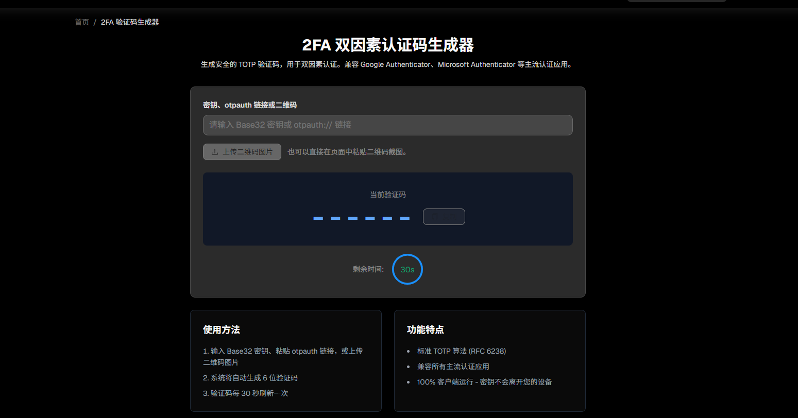

# Hosted TOTP

一个可运行的 TOTP 托管式服务：

- Web 端：登录页 + 导入/查询页面
- API 端：导入 Base32 密钥 / otpauth URI / 二维码图片、按唯一标识查询、批量查询
- 鉴权：API Key（不同 key 数据隔离）
- 敏感存储：TOTP secret 使用 AES-GCM 加密保存

## 唯一标识规则

固定格式：`16位固定编码字符串`

示例：`6f1c9a2b7e4d8c03`

同一 API Key 下，相同规范化密钥、算法、位数和周期会生成相同唯一标识；标识按 API Key 隔离。

## 目录

- `app/main.py`: FastAPI 入口
- `app/db.py`: SQLite 数据层
- `app/otp.py`: otpauth 解析与 TOTP 生成
- `app/security.py`: API Key 哈希 + secret 加解密
- `app/templates/`: Web 页面
- `app/static/`: 样式

## 启动

1. 进入目录

```bash
cd d:/Code/Test/totp-hosted
```

1. 创建虚拟环境并安装依赖

```bash
python -m venv .venv
.venv\\Scripts\\activate
pip install -r requirements.txt
```

1. 可选：配置环境变量（未配置时会自动生成 `.dev_master_key` 供本地开发）

- 复制 `.env.example` 到你的环境变量系统，或直接设置：
  - `APP_MASTER_KEY`
  - `APP_DB_PATH`
  - `APP_MAX_UPLOAD_BYTES`
  - `APP_WEB_COOKIE_NAME`

1. 启动

```bash
uvicorn app.main:app --reload --port 8010
```

打开：`http://127.0.0.1:8010`

## Docker 启动

1. 构建镜像

```bash
cd d:/Code/Test/totp-hosted
docker build -t totp-hosted:latest .
```

1. 运行容器

```bash
docker run --name totp-hosted -p 8010:8010 -e APP_DB_PATH=/data/data.db -v totp_data:/data --rm totp-hosted:latest
```

1. 或使用 compose

```bash
docker-compose up -d --build
```

1. 访问

`http://127.0.0.1:8010`

## API 示例

控制台内提供独立接口文档页面：`http://127.0.0.1:8010/api-docs`。

### 1) 生成 API Key

```bash
curl -X POST http://127.0.0.1:8010/api/keys/generate \\
  -H "Content-Type: application/json" \\
  -d '{"name":"demo"}'
```

### 2) 导入 Base32 密钥或 otpauth URI（绑定）

```bash
curl -X POST http://127.0.0.1:8010/api/totp/import-source \
  -H "Content-Type: application/json" \
  -H "X-API-Key: <你的API_KEY>" \
  -d '{"base32_secret":"JBSW Y3DP EHPK 3PXP"}'
```

```bash
curl -X POST http://127.0.0.1:8010/api/totp/import-source \
  -H "Content-Type: application/json" \
  -H "X-API-Key: <你的API_KEY>" \
  -d '{"otpauth_uri":"otpauth://totp/GitHub:alice@example.com?secret=JBSWY3DPEHPK3PXP&issuer=GitHub&algorithm=SHA1&digits=6&period=30"}'
```

兼容旧路径：`POST /api/totp/import-uri` 仍可继续使用。

### 3) 按唯一标识查询动态码

```bash
curl -X GET "http://127.0.0.1:8010/api/totp/code/a1b2c3d4" \\
  -H "X-API-Key: <你的API_KEY>"
```

### 4) 批量查询

```bash
curl -X POST http://127.0.0.1:8010/api/totp/codes/batch \\
  -H "Content-Type: application/json" \\
  -H "X-API-Key: <你的API_KEY>" \\
  -d '{"ids":["a1b2c3d4","x9y8z7w6"]}'
```

### 5) Base32 / URI 直接取码（可选落库）

- 不传 `email`：一次性生成，返回 `code`，不落库。
- 传入 `email`：生成 `unique_id` 并落库，返回 `code + unique_id`，可后续用 `GET /api/totp/code/{unique_id}` 二次取码。

```bash
curl -X POST http://127.0.0.1:8010/api/totp/code-from-source \
  -H "Content-Type: application/json" \
  -H "X-API-Key: <你的API_KEY>" \
  -d '{"base32_secret":"JBSW Y3DP EHPK 3PXP"}'
```

```bash
curl -X POST http://127.0.0.1:8010/api/totp/code-from-source \
  -H "Content-Type: application/json" \
  -H "X-API-Key: <你的API_KEY>" \
  -d '{"otpauth_uri":"otpauth://totp/GitHub:alice@example.com?secret=JBSWY3DPEHPK3PXP&issuer=GitHub"}'
```

带邮箱落库示例：

```bash
curl -X POST http://127.0.0.1:8010/api/totp/code-from-source \
  -H "Content-Type: application/json" \
  -H "X-API-Key: <你的API_KEY>" \
  -d '{"otpauth_uri":"otpauth://totp/GitHub:alice@example.com?secret=JBSWY3DPEHPK3PXP&issuer=GitHub","email":"alice@example.com"}'
```

兼容旧路径：`POST /api/totp/code-from-uri` 仍可继续使用。

## Web 行为说明

- 生成验证码支持拖拽/上传二维码、粘贴 otpauth URI、输入 Base32 密钥。
- 上传二维码会先识别并回填链接；如果点击生成时仍选择了图片，则以图片内容为准。
- 重复导入同一密钥或同一 otpauth 链接时，会复用已有唯一标识，不新增重复卡片。
- 生成记录后返回 16 位固定唯一标识，首页卡片展示当前动态码、剩余秒数，并在周期结束后自动刷新轮换。
- 首页支持按唯一标识模糊搜索和一键复制验证码。
- `GET /api/totp/list` 返回列表记录的当前 `code/period/remaining`，但不会返回 secret 或密文。

## 安全说明

> 风险提醒：为支持通过接口二次获取验证码，本项目会在服务端保存必要的 TOTP 配置信息（密钥会加密存储）。请仅在你信任并可控的环境中使用，妥善保管 API Key；因使用本项目或配置不当造成的风险与损失，由使用者自行承担，本项目不承担责任。

- API Key 仅保存哈希值，不明文落库
- secret 使用 AES-GCM 加密后存储
- Web 与 API 访问都要求 API Key
- 接口响应不返回 secret
- 上传二维码图片只用于识别，不会持久化保存；上传对象读取后会关闭
- Docker 默认把开发主密钥保存到 `/data/.master_key`，避免容器重建后无法解密旧数据。

## 已知限制

- API Key 生成接口默认开放，便于演示
- 未接入 KMS/Vault、审计日志与复杂 RBAC
- 使用 SQLite，适合单机
